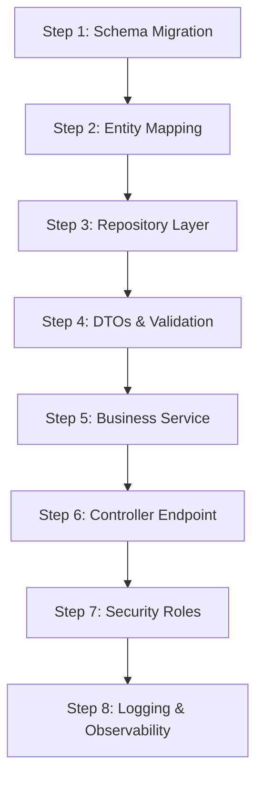

# The Spring Boot & Spring Security Developer Roadmap

This roadmap outlines the exact steps to build a production-ready Java backend application, structured directly from the **EazyBytes "Master Spring, Spring Boot, REST, JPA, Spring Security"** curriculum. 

It is divided into two distinct sections: **One-Time Initialization** (setting up the foundation) and the **Per-Feature Development Cycle** (the repeatable workflow for each new feature).

---

# 🏗️ Part 1: One-Time Initialization & Project Foundation
*Execute these steps once at the start of your project to establish a robust, secure, and clean architecture.*

### Step 1: Initialize Maven & Build Tool Configuration
* **Action**: Configure your root `pom.xml` to manage dependencies.
* **Key Dependencies**:
  * Spring Boot Parent: Sets up standard dependency versions.
  * Spring Boot Starters: `spring-boot-starter-web`, `spring-boot-starter-data-jpa`, `spring-boot-starter-validation`, `spring-boot-starter-security`, `spring-boot-starter-actuator`.
  * Developer Experience: `spring-boot-devtools`, `lombok`, `mapstruct`, `spring-boot-configuration-processor`.
* **Skills**: Managing dependency scopes (`compile`, `test`, `provided`, `runtime`), avoiding version conflicts, and understanding the Maven lifecycle.

### Step 2: Establish the Monolithic Package Structure
* **Action**: Implement a **By Feature / Domain** package structure rather than a traditional layered structure.
* **Skills**: Organize folders by business capabilities (e.g., `app.users`, `app.billing`, `app.inventory`) instead of putting all controllers or services in massive single folders. This supports high modularity and keeps the modular monolith clean.

### Step 3: Application Properties & Environment Profiles
* **Action**: Setup configuration files for dev and production environments.
* **Skills**: 
  * Define configuration variables in `application.yml`.
  * Create environment-specific profiles: `application-dev.yml` (e.g. H2 database, DevTools enabled) and `application-prod.yml` (e.g. PostgreSQL, DevTools disabled).
  * Bind config parameters to Java using `@Value` or type-safe `@ConfigurationProperties`.

### Step 4: Configure Relational Database & Auditing Infrastructure
* **Action**: Establish the database connection and global record audit logging.
* **Skills**:
  * Define connection properties (`spring.datasource.url`).
  * Enable JPA auditing using `@EnableJpaAuditing(auditorAwareRef = "auditorProvider")`.
  * Implement `AuditorAware<String>` to dynamically fetch the logged-in user from the Spring Security context (fallback to `"System"` for anonymous tasks).
  * Create a reusable abstract `BaseEntity` annotated with `@MappedSuperclass` and `@EntityListeners(AuditingEntityListener.class)` containing audit fields:
    * `@CreatedDate` / `@CreatedBy`
    * `@LastModifiedDate` / `@LastModifiedBy`

### Step 5: Configure Global API Routing & CORS
* **Action**: Standardize API versioning and whitelist cross-origin requests.
* **Skills**:
  * Setup CORS globally by implementing the `WebMvcConfigurer` interface and overriding `addCorsMappings()` to whitelist your frontend origin (e.g. `http://localhost:5173`).
  * Enforce URI API Versioning (e.g., prefixing requests with `/api/v1/`).

### Step 6: Define Global Exception Handling & Input Validation
* **Action**: Configure central request sanitization and error formatters.
* **Skills**:
  * Create a class annotated with `@RestControllerAdvice`.
  * Define methods annotated with `@ExceptionHandler` to intercept exceptions (like resource not found, database violations, or validation errors) and format them into consistent JSON error response bodies.

### Step 7: Global Spring Security Setup
* **Action**: Configure the framework's web security configurations and password encryption.
* **Skills**:
  * Create a `SecurityFilterChain` bean to configure endpoint authorization (`permitAll` vs `authenticated`).
  * Define a `BCryptPasswordEncoder` bean for hashing passwords securely.
  * Enable CORS and configure CSRF cookies (`CookieCsrfTokenRepository` with `CsrfTokenRequestAttributeHandler`).
  * Set session policy to stateless (`SessionCreationPolicy.STATELESS`) to support Token authentication.
  * Write custom JWT filters (`JwtTokenGeneratorFilter` and `JwtTokenValidatorFilter`) and register them in the filter chain.
  * Optionally, add `spring-boot-starter-oauth2-client` for social login configurations.

### Step 8: Infrastructure & Docker Integration
* **Action**: Containerize the database, caching layer, and application build environments.
* **Skills**:
  * Write a multi-stage `Dockerfile` (Stage 1 uses Maven to package the `.jar`; Stage 2 uses JRE Alpine to run it).
  * Create a `docker-compose.yml` to spin up supporting services (PostgreSQL, Redis, RabbitMQ) and link them to your Spring application container.

---

# 🔄 Part 2: Per-Feature Development Cycle (The Repeatable Loop)
*Repeat these steps sequentially for each new business capability or feature you build.*

### Step 1: Define Database Schema Migration
* **Action**: Write SQL migrations instead of using Hibernate's `ddl-auto: update` to modify database structure safely.
* **Skills**: Create versioned migration files in Flyway (`V1__create_table.sql` under `db/migration`) or Liquibase change sets to alter tables and register indexes.

### Step 2: Implement the Entity Layer
* **Action**: Create the domain object and map it to your database table.
* **Skills**:
  * Map columns using `@Entity`, `@Table`, `@Id`, and `@GeneratedValue`.
  * **Inherit Auditing**: Extend the global `BaseEntity` to automatically inherit tracking columns.
  * Define associations: `@ManyToOne`, `@OneToMany`, `@ManyToMany`. Set lazy loading (`FetchType.LAZY`) to avoid performance bottlenecks.

### Step 3: Create the Repository Layer
* **Action**: Build the data access abstraction layer.
* **Skills**:
  * Create an interface extending `JpaRepository<MyEntity, Long>`.
  * Add custom query requirements using **Derived Query Methods** (e.g. `findByStatus`) or explicit JPQL/Native SQL query annotations via `@Query`.
  * Apply pagination and sorting using `Pageable` parameters.

### Step 4: Write DTOs & Mappers
* **Action**: Define transfer objects and mapping interfaces to isolate presentation data from database entities.
* **Skills**:
  * Create DTO record/classes for request payloads and response bodies.
  * Apply Java Bean Validation constraints on the request DTOs (`@NotNull`, `@NotBlank`, `@Size`, `@Email`).
  * Create a **MapStruct** Mapper interface (e.g., `MyMapper`) to automatically map fields between Entities and DTOs at compile time.

### Step 5: Build Business Logic (Service Layer)
* **Action**: Write the core logic of the feature, registering it in the Spring IoC container.
* **Skills**:
  * Annotate classes with `@Service`.
  * Use **Constructor-based Dependency Injection** to inject repositories or other services (avoid `@Autowired` field injection).
  * Enforce atomic operations and transactional rules using `@Transactional`.

### Step 6: Expose Endpoint (Controller Layer)
* **Action**: Map HTTP requests and execute service flows.
* **Skills**:
  * Create a controller annotated with `@RestController` and `@RequestMapping("/api/v1/my-feature")`.
  * Write verb mappings (`@GetMapping`, `@PostMapping`, etc.).
  * Extract input payloads safely using `@RequestBody` (prefixed with `@Valid` to trigger sanitization), `@PathVariable`, or `@RequestParam`.
  * Return DTO responses wrapped in `ResponseEntity` to return precise HTTP status codes (e.g. `201 Created` for creations, `200 OK` for reads).

### Step 7: Enforce Security Controls
* **Action**: Secure the new endpoints using roles and permissions.
* **Skills**: Add method security annotations like `@PreAuthorize("hasRole('ADMIN')")` or `@PreAuthorize("hasAuthority('WRITE_PERMISSION')")` on the service methods or controllers.

### Step 8: Log & Monitor Feature Performance
* **Action**: Add logging tracing and metrics tracking to ensure features are observable.
* **Skills**:
  * Annotate classes with Lombok's `@Slf4j` and place structured log markers throughout logic branches (`log.info()`, `log.error()`).
  * Make endpoints trackable in Actuator `/metrics` and `/prometheus` using customized Prometheus counter/gauge bindings if custom metrics are needed.